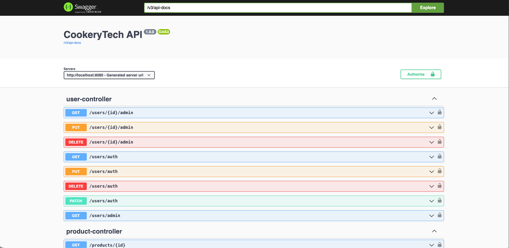
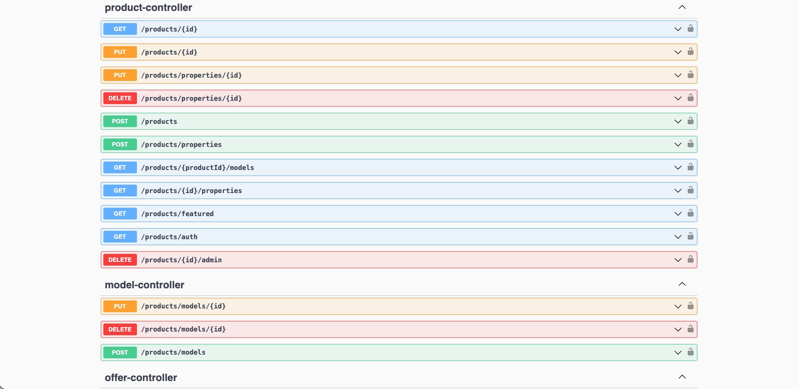
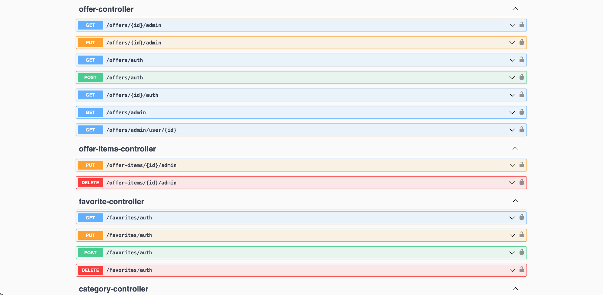
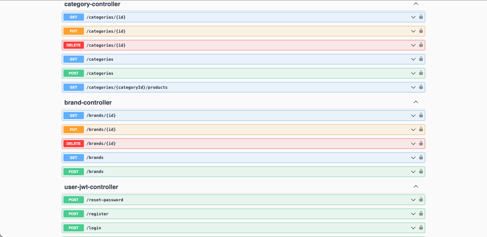
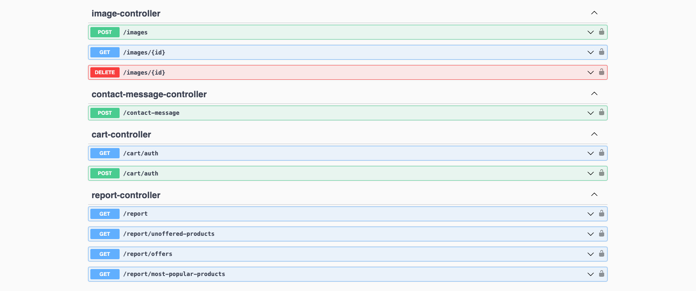
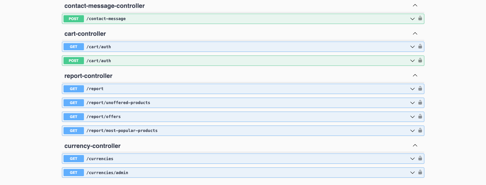
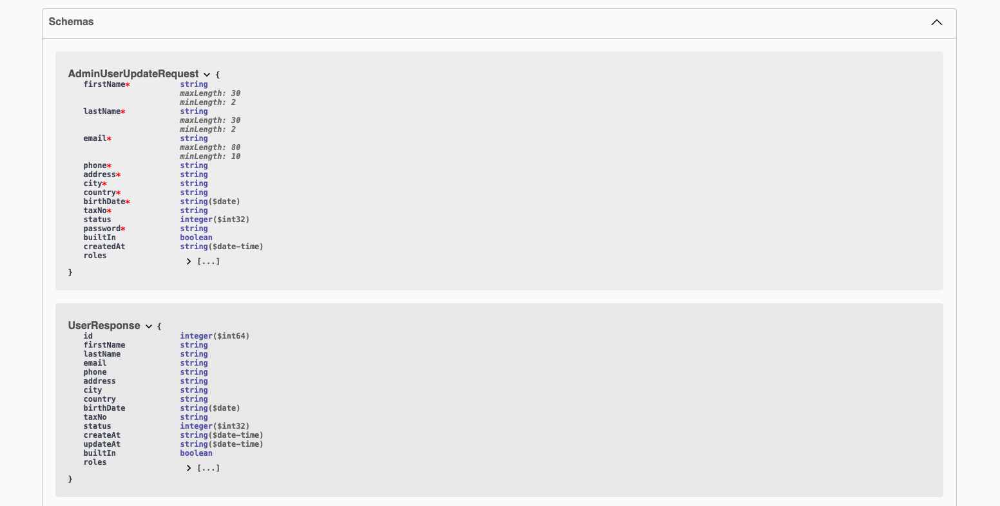
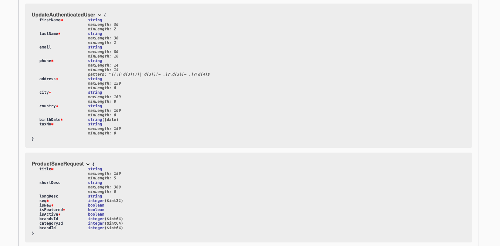

# 🍳 CookeryTech - B2B Commercial Kitchen Equipment E-Commerce API

CookeryTech is a robust, secure, and scalable RESTful Backend Service built with Java & Spring Boot for managing B2B commercial kitchen equipment sales, currency conversions, and multi-role operations.

---

## 🛠️ Tech Stack & Architecture

* **Core Framework:** Java 11 / 17, Spring Boot 2.7.x
* **Security & Auth:** Spring Security, JWT (JSON Web Token), Role-Based Access Control (RBAC)
* **Database & ORM:** PostgreSQL, Spring Data JPA, Hibernate
* **Mapping & DTOs:** MapStruct, Lombok
* **External Services & Scraping:** JSoup (TCMB Scheduled Rate Scraper)
* **Documentation & Tools:** SpringDoc OpenAPI (Swagger UI), Maven

---

## ✨ Key Features

* **Multi-Role Security:** Granular access controls for `Customer`, `Manager`, and `Admin` using JWT authentication.
* **Automated Currency Rates:** Scheduled task fetches real-time exchange rates from the Central Bank of Turkey (TCMB) via XML scraping to keep multi-currency prices updated.
* **Optimized Data Retrieval:** Spring Data Pageable integration across high-volume endpoints for performance-focused pagination.
* **Data Mapping Layer:** High-performance DTO-Entity mappings powered by MapStruct.
* **Interactive API Documentation:** Full Swagger UI setup for testing endpoints and reviewing data models.

---

## 🏛️ System Architecture

```text
[ React Frontend / Postman ]
            │
            ▼
   [ Spring Security Filter Chain (JWT) ]
            │
            ▼
   [ REST Controllers ] ──► [ Services Layer ] ──► [ Scheduled Tasks (TCMB Scraper) ]
            │                       │
            ▼                       ▼
   [ MapStruct DTOs ]       [ JPA Repositories ]
                                    │
                                    ▼
                          [ PostgreSQL Database ]
```
---

## 🚀 Getting Started

### Prerequisites

* JDK 11 or higher
* PostgreSQL installed and running
* Maven

### Installation & Run

1. **Clone the repository:**
   ```bash
   git clone [https://github.com/atilgannnn/CookeryTech.git](https://github.com/atilgannnn/CookeryTech.git)
   cd CookeryTech

2. **Properties:**
   ```bash
   spring.datasource.url=jdbc:postgresql://localhost:5432/cookerytech_db
   spring.datasource.username=your_username
   spring.datasource.password=your_password

4. **Build & Run:***
   ```bash
   ./mvnw clean install
   ./mvnw spring-boot:run

5. 📑 **API Documentation:**

Once the application is running, you can access the interactive Swagger UI at:
   ```bash
   Swagger Documentation: `http://localhost:8080/swagger-ui/index.html`
   OpenAPI Specs: `http://localhost:8080/v3/api-docs`
```
---

## 📸 API Interface Screenshots (Swagger UI)

<p align="center">
  
  
</p>
<p align="center">
  
  
</p>
<p align="center">
  
  
</p>
<p align="center">
  
  
</p>

> **Note:** All endpoints are secured with JWT. The locked icons indicate authorization is required.
